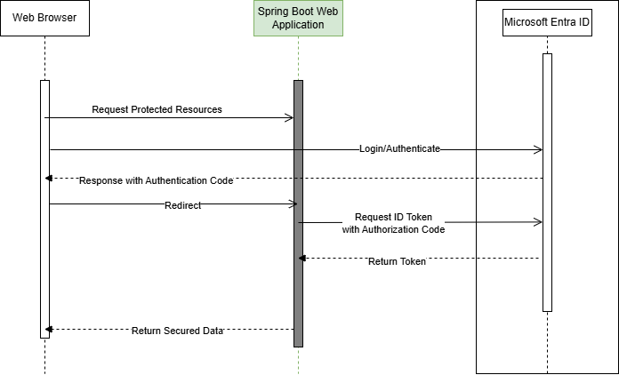

# User Microsoft Identity API

## Overview
This is a reference Spring Boot application for using Microsoft Identity to secure Restful API's.

## Authentication
A request is made to the Entra protected resource and the if a valid token is included in the request, the resources are granted.  If the request cannot be validated, then a request is made to the Entra ID service to authenticate the user.  A check is also made to make sure the user is authorized to gain access to the requested resource.  If the user is authenticated and authorized, the request is returned with the resource.



## Deployment

### Deploy Locally (External to Azure)

### Deploy to Azure

Set environment variables.

### Unix/Linux/MacOS

```sh
export RESOURCE_GROUP="ms-identity-containerapps"
export LOCATION="canadacentral"
export ENVIRONMENT="env-ms-identity-containerapps"
export API_NAME="ms-identity-api"
export JAR_FILE_PATH_AND_NAME="./target/ms-identity-spring-boot-webapp-0.0.1-SNAPSHOT.jar"
```

Create a resource group.

```sh
az group create --name $RESOURCE_GROUP --location $LOCATION 
```

Create an environment with an auto-generated Log Analytics workspace.

```sh
az containerapp env create --name $ENVIRONMENT --resource-group $RESOURCE_GROUP --location $LOCATION
```

Show the default domain of the container app environment. Note down this domain to use in later sections.

```sh
az containerapp env show --name $ENVIRONMENT --resource-group $RESOURCE_GROUP --query properties.defaultDomain
```

### Windows 11

```ps1
$env:RESOURCE_GROUP="ms-identity-containerapps"
$env:LOCATION="canadacentral"
$env:ENVIRONMENT="env-ms-identity-containerapps"
$env:API_NAME="ms-identity-api"
$env:JAR_FILE_PATH_AND_NAME="./target/ms-identity-spring-boot-webapp-0.0.1-SNAPSHOT.jar"

$env:RESOURCE_GROUP="ms-identity-containerapps"
```

Create a resource group.

```sh
az group create --name $env:RESOURCE_GROUP --location $$env:LOCATION 
```

Create an environment with an auto-generated Log Analytics workspace.

```sh
az containerapp env create --name $env:ENVIRONMENT --resource-group $env:RESOURCE_GROUP --location $env:LOCATION
```

Show the default domain of the container app environment. Note down this domain to use in later sections.

```sh
az containerapp env show --name $env:ENVIRONMENT --resource-group $env:RESOURCE_GROUP --query properties.defaultDomain
```

## Reference
- [Microsoft Authentication Library for Java](https://learn.microsoft.com/en-us/entra/msal/java/)
- [What is the Microsoft identity platform?](https://learn.microsoft.com/en-us/entra/identity-platform/v2-overview)
- [Secure Java Spring Boot apps using Microsoft Entra ID](https://learn.microsoft.com/en-us/azure/developer/java/identity/enable-spring-boot-webapp-authentication-entra-id?tabs=aca)
- [Spring Cloud Azure documentation](https://learn.microsoft.com/en-us/azure/developer/java/spring-framework/)
- [Deploy Java Spring Boot apps to Azure Container Apps](https://learn.microsoft.com/en-us/azure/developer/java/identity/deploy-spring-boot-to-azure-container-apps)
- [Dependabot options reference](https://docs.github.com/en/code-security/dependabot/working-with-dependabot/dependabot-options-reference)